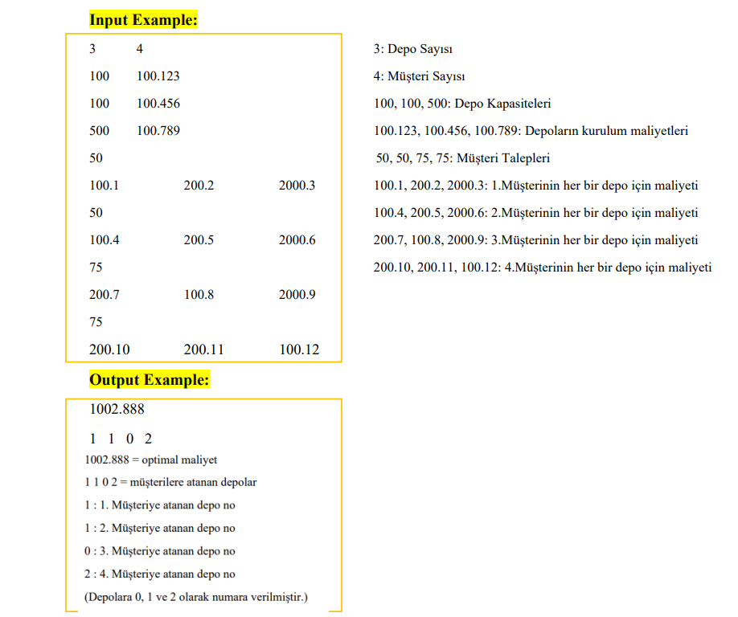

<h1>Warehouse Location Problem(Depo Yerleşim Problemi)</h1>

Bu projede Warehouse Location Problem(Depo Yerleşim Problemi)'nin Tabu Arama algoritma ile çözümü ele alınmıştır.
Tabu arama algoritması, verilen tabu boyutunda (genetik algoritmadaki popülasyon gibi düşünebilirsiniz.)
verilen iterasyon sayısı kadar döner ve en optimal sonucu bulmaya çalışır. Burada iterasyon sayısını 
yüksek tutmak bizim için global optimum çözüm açısından faydalı olacaktır çünkü her bir iterasyonda
global optimal çözüme bir adım daha yakınsar ancak madalyonun diğer yüzünden bakıcak olursak
bizim için memory ve zaman açısından da maliyetli olacaktır, bunun için verilen dosya boyutuna 
göre(eğer düşük boyutlu ise iterasyon yüksek, yüksek boyutlu ise iterasyon düşük) uygun
bir iterasyon sayısı verilmesi gerekir. Bu örnek uygulama ise şu şekildedir: 
Bir dağıtım şirketi birçok farlı müşteriye ürün sağlamak için depoları kullanır. Bu 
problemin amacı, müşterilere hizmet vermek için hangi depoların en uygun maliyetli olacağını 
belirlemektir. Ancak burada her depo farklı maliyetlere ve depolama kapasitelerine sahiptir.

<b>Kullanılan Dil:</b> C#

<b>Not: </b>Kullanılan girdi dosyalarına Datas klasörü altından erişebilirsiniz.(wl_16_1.txt,wl_200_2.txt,wl_500_3.txt)

<h3>Kurulum</h3>
Uygulamayı indirdikten sonra start ikonuna basarak çalıştırabilirsiniz.
